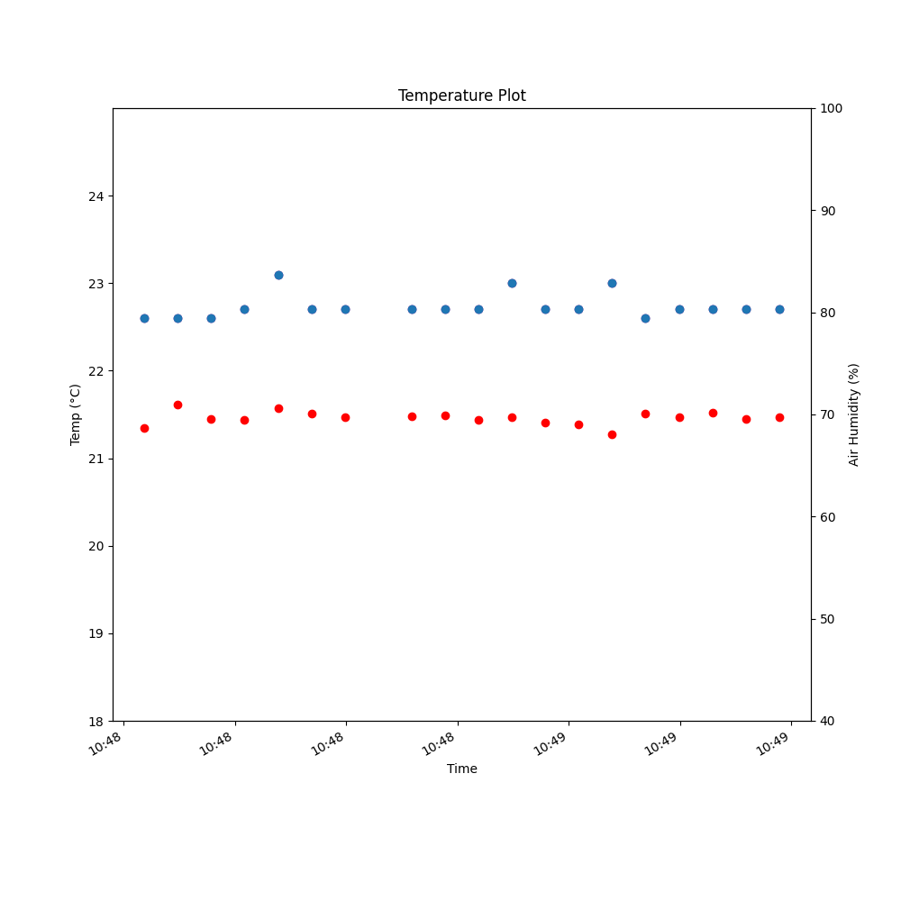

<div id="top"></div>
<!--
*** Thanks for checking out the Best-README-Template. If you have a suggestion
*** that would make this better, please fork the repo and create a pull request
*** or simply open an issue with the tag "enhancement".
*** Don't forget to give the project a star!
*** Thanks again! Now go create something AMAZING! :D
-->


<!-- PROJECT SHIELDS -->
<!--
*** I'm using markdown "reference style" links for readability.
*** Reference links are enclosed in brackets [ ] instead of parentheses ( ).
*** See the bottom of this document for the declaration of the reference variables
*** for contributors-url, forks-url, etc. This is an optional, concise syntax you may use.
*** https://www.markdownguide.org/basic-syntax/#reference-style-links
-->
[![Contributors][contributors-shield]][contributors-url]
[![Forks][forks-shield]][forks-url]
[![Stargazers][stars-shield]][stars-url]
[![Issues][issues-shield]][issues-url]
[![AGPL License][license-shield]][license-url]


<!-- PROJECT LOGO -->
<br />
<div align="center">
  <a href="https://github.com/networkscientist/KiraPi">
    
  </a>

<h3 align="center">KiraPi</h3>

  <p align="center">
    The KiraPi system was created as part of the Seminar Geodata Analysis. It currently monitors air temperature as well as the relative humidity of the air through a DHT22 sensor. Furthermore, the collected data is represented in graphs. The project is built on top of a Raspberry Pi system and coded in Python3.
    <br />
    <a href="https://github.com/networkscientist/KiraPi/wiki"><strong>Explore the wiki »</strong></a>
    <br />
    <br />
    <a href="https://github.com/networkscientist/KiraPi/issues">Report Bug</a>
    ·
    <a href="https://github.com/networkscientist/KiraPi/issues">Request Feature</a>
  </p>
</div>


<!-- TABLE OF CONTENTS -->
<details>
  <summary>Table of Contents</summary>
  <ol>
    <li>
      <a href="#about-the-project">About The Project</a>
      <ul>
        <li><a href="#built-with">Built With</a></li>
      </ul>
    </li>
    <li>
      <a href="#getting-started">Getting Started</a>
      <ul>
        <li><a href="#prerequisites">Prerequisites</a></li>
        <li><a href="#installation">Installation</a></li>
      </ul>
    </li>
    <li><a href="#usage">Usage</a>
    <ul>
        <li><a href="#main-script">Main Script</a></li>
        <li><a href="#functions">Functions</a></li>
    </ul>
    </li>
    <li><a href="#roadmap">Roadmap</a></li>
    <li><a href="#contributing">Contributing</a></li>
    <li><a href="#license">License</a></li>
    <li><a href="#contact">Contact</a></li>
    <li><a href="#acknowledgments">Acknowledgments</a></li>
  </ol>
</details>


<!-- ABOUT THE PROJECT -->
## About The Project

[![Product Name Screen Shot][product-screenshot]](https://example.com)

This project has been created as part of the course _Geodata Analysis and Modelling_, having taken place during 2021 at the University Bern. Big thank go to [Pascal Horton](@pascalhorton) and [Andreas Paul Zischg](@zischg) for leading the seminar.

Generally, use this README.md file for instructions on the installation and usage of the scripts. Additional info may be found in the [wiki](https://github.com/networkscientist/KiraPi/wiki). The latter, however is nowhere near complete. Furthermore, GitHub functions such as _Projects_ or _Milestones_ have been used by me in order to learn about them. Do not rely on them, though!

The project which was handed in is released as V1.0. To replicate the environment, install Python 3.7.3 and use the Pipfile in this repo.

<p align="right">(<a href="#top">back to top</a>)</p>


### Built With

* [Python3](https://python.org/)
* [Raspbian](https://raspbian.org)
<p align="right">(<a href="#top">back to top</a>)</p>


<!-- GETTING STARTED -->
## Getting Started

To get a local copy up and running follow these simple steps.

### Prerequisites

Using Raspbian, you will need the pigpio packages in order to be able to access the GPIO pins from the python script. The most recent version can be found on the Github project page [pigpio](https://github.com/joan2937/pigpio/). Further installation instructions can be found on the project's web page [abyz.me.uk](https://abyz.me.uk/rpi/pigpio/download.html)

Alternatively, you may use the apt package manager from a bash shell to install the packages.
```shell
sudo apt-get update
sudo apt-get install pigpio python-pigpio python3-pigpio
```

You will additionally need pigpiod to run the pigpio library as a daemon:
```shell
sudo apt-get install pigpiod
```
Either run `pigpiod` with superuser rights before using the KiraPi scripts or add the daemon to the startup applications.

For the purposes of the geodata seminar, KiraPi was set up with v79 of `pigpio`, installed through the apt package manager.
### Installation
#### Environment
1. Set up the Raspberry Pi with Python3
2. Connect the DHT22 sensor with the Raspberry Pi. Take a note of the BCM pin where the sensor is attached.
3. Clone the repo and cd into it:
    ```shell
    git clone https://github.com/networkscientist/KiraPi.git
    cd KiraPi
    ```
4. Create the pipenv environment and install the packages from the Pipfile:
    ```shell
    pipenv shell
    pipenv install
    ```
#### Customize setting
5. Update the BCM pin number in `main.py` to match your setting
   ```python
   ## Initial Values
   gpio = 4 # BCM Numbering
   ```
6. Update the path where your log file should be stored in `dht22.py`
   ```python
   ## Initial Values
   csv_path = "/home/pi/KiraPi/output/sens.txt" # Where the measurements will be stored
    ```

<p align="right">(<a href="#top">back to top</a>)</p>


<!-- USAGE EXAMPLES -->
## Usage
### Main Script
To start a measurement batch, simply start the script with python in your environment. In the example below, you would use the bash shell and python3:
```shell
pipenv run python3 main.py
```
Without error, you will get two files: `sens.txt` and `figure.png`.

*The resulting plot*
![Result Table][result-table]
*The resulting CSV file*

### Functions
If you want to call the functions provided in the KiraPi folder, simply load the files into your favourite editor and call the desired function. Since my Raspi3 lacked the power to run PyCharm, I used IdleX on Raspbian through a remote desktop session.

_For a detailed documentation of the functions, please use the [wiki](https://github.com/networkscientist/KiraPi/wiki/Usage)_
<p align="right">(<a href="#top">back to top</a>)</p>


<!-- ROADMAP -->
## Roadmap

- [x] Read from DHT22 sensor
- [x] Plot measurements
- [x] Save measurements/plot to files
- [~] Read from soil moisture sensor: In development branch [2-soil-moisture-data](https://github.com/networkscientist/KiraPi/tree/2-soil-moisture-data)
- [~] Store config values in external YAML file: In development branch [12-outsource-config](https://github.com/networkscientist/KiraPi/tree/12-outsource-config)

See the [open issues](https://github.com/networkscientist/KiraPi/issues) for a full list of proposed features (and known issues).

<p align="right">(<a href="#top">back to top</a>)</p>


<!-- CONTRIBUTING -->
## Contributing

Contributions are what make the open source community such an amazing place to learn, inspire, and create. Any contributions you make are **greatly appreciated**.

If you have a suggestion that would make this better, please fork the repo and create a pull request. You can also simply open an issue with the tag "enhancement".
Don't forget to give the project a star! Thanks again!

1. Fork the Project
2. Create your Feature Branch (`git checkout -b feature/AmazingFeature`)
3. Commit your Changes (`git commit -m 'Add some AmazingFeature'`)
4. Push to the Branch (`git push origin feature/AmazingFeature`)
5. Open a Pull Request

<p align="right">(<a href="#top">back to top</a>)</p>


<!-- LICENSE -->
## License

Distributed under the GNU Affero General Public License v3.0. See `LICENSE.txt` for more information.

<p align="right">(<a href="#top">back to top</a>)</p>


<!-- CONTACT -->
## Contact

Peter Zweifel - networkscientist@protonmail.com

Project Link: [https://github.com/networkscientist/KiraPi](https://github.com/networkscientist/KiraPi)

<p align="right">(<a href="#top">back to top</a>)</p>


<!-- ACKNOWLEDGMENTS -->
## Acknowledgments

* For a great README.md template: [README Template](https://github.com/othneildrew/Best-README-Template)
* For the _Geodata Seminar_ and feedback on the code: [Pascal Horton](@pascalhorton) & [Andreas Paul Zischg](@zischg) - University Bern
* My cat: For allowing me to use her name and portrait

<p align="right">(<a href="#top">back to top</a>)</p>


<!-- MARKDOWN LINKS & IMAGES -->
<!-- https://www.markdownguide.org/basic-syntax/#reference-style-links -->
[contributors-shield]: https://img.shields.io/github/contributors/networkscientist/KiraPi.svg?style=for-the-badge
[contributors-url]: https://github.com/networkscientist/KiraPi/graphs/contributors
[forks-shield]: https://img.shields.io/github/forks/networkscientist/KiraPi.svg?style=for-the-badge
[forks-url]: https://github.com/networkscientist/KiraPi/network/members
[stars-shield]: https://img.shields.io/github/stars/networkscientist/KiraPi.svg?style=for-the-badge
[stars-url]: https://github.com/networkscientist/KiraPi/stargazers
[issues-shield]: https://img.shields.io/github/issues/networkscientist/KiraPi.svg?style=for-the-badge
[issues-url]: https://github.com/networkscientist/KiraPi/issues
[license-shield]: https://img.shields.io/github/license/networkscientist/KiraPi.svg?style=for-the-badge
[license-url]: https://github.com/networkscientist/KiraPi/blob/master/LICENSE.txt
[product-screenshot]: images/figure.png
[result-table]: images/results.png
